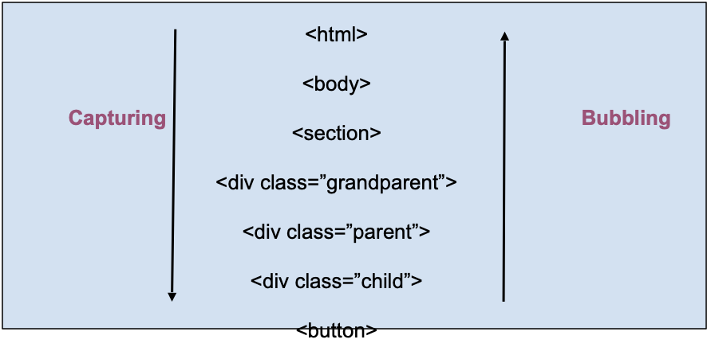

# JavaScript Questions:

## Q7: Explain pass by value and pass by reference in JavaScript.
### Pass by value:
function is called by directly passing the value of the variable as an argument. So any changes made inside the function does not affect the original value.
-  parameters passed as arguments create their own copy.

<br/>

### Pass by reference:

> In JavaScript - array and Object follows the “pass by reference” property.

Function is called by directly passing the reference/address of the variable as an argument. So changing the value inside the function also changes the original value.


Example:
```js
let obj = {
	a: 10,
	b: 20
}

function PassbyReference(obj) {
	let tmp = obj.a;
	obj.a = obj.b;
	obj.b = tmp;
               
   console.log(`Inside Pass By Reference Function -> a = ${obj.a} b = ${obj.b}`);
}
```

<br/>

## Q8. What do you mean by strict mode in JavaScript?
- introduced in ECMAScript 5.
- It eliminates some JavaScript silent errors by changing them to throw errors.

- Strict mode applies to entire scripts or to individual functions.
It doesn’t apply to block statements enclosed in `{}` braces.
- You can implement strict mode by adding `“use strict”;` to the beginning of a script or a function.


### Strict Mode for scripts:
```js
'use strict';  //You're in Strict Mode!
var x = "Hello World!";
```

### Strict Mode for functions
```js
function cool() {
            "use strict";
            // ... your code …


            // this function is executed in strict mode
}
```
//anything outside of the function will be in non-strict mode.

<br/>

## Q9. Explain Hoisting.
Hoisting is a JavaScript mechanism where variables and function declarations are moved to the top of their scope before code execution.

Inevitably, this means that no matter where functions and variables are declared, they are moved to the top of their scope regardless of whether their scope is `global` or `local`.

<br/>

## Q10. What is Temporal Dead Zone?
A temporal dead zone (TDZ) is the area of a block where a variable is inaccessible until the moment the computer completely initializes it with a value.
- A block is a pair of braces `({...})` used to group multiple statements.
- Initialization occurs when you assign an initial value to a variable.

Suppose you attempt to access a variable before its complete initialization. In such a case, JavaScript will throw a ReferenceError.

- So, to prevent JavaScript from throwing such an error, you’ve got to remember to access your variables from outside the temporal dead zone.

### Here’s an example:
```js
{
  // bestFood’s TDZ starts here (at the beginning of this block’s local scope)
  // bestFood’s TDZ continues here
  // bestFood’s TDZ continues here
  // bestFood’s TDZ continues here
  console.log(bestFood); // returns ReferenceError because bestFood’s TDZ continues here
  // bestFood’s TDZ continues here
  // bestFood’s TDZ continues here
  let bestFood = "Vegetable Fried Rice"; // bestFood’s TDZ ends here
  // bestFood’s TDZ does not exist here
  // bestFood’s TDZ does not exist here
  // bestFood’s TDZ does not exist here
}
```

<br/>

## Q11. What is difference between let, var and const?
| var | let	| const |
| --- | --- | --- |
| The scope of a var variable is functional scope. | The scope of a let variable is block scope. | The scope of a const variable is block scope. |
| It can be updated and re-declared into the scope. | It can be updated but cannot be re-declared into the scope. |It cannot be updated or re-declared into the scope.|
| It can be declared without initialization. | It can be declared without initialization.| It cannot be declared without initialization.|
|It can be accessed without initialization as its default value is “undefined”.|It cannot be accessed without initialization otherwise it will give ‘referenceError’.|It cannot be accessed without initialization, as it cannot be declared without initialization.|
|hoisting done, with initializing as ‘default’ value.|Hoisting is done, but not initialized (this is the reason for the error when we access the let variable before declaration/initialization).|	Hoisting is done, but not initialized (this is the reason for the error when we access the const variable before declaration/initialization).|

<br/>

## Q12. Why do we use debugger word in javascript?
The debugger keyword stops the execution of JavaScript, and calls (if available) the debugging function.
- This has the same function as setting a breakpoint in the debugger.
- If no debugging is available, the debugger statement has no effect.
- Built-in debuggers can be turned on and off, forcing errors to be reported to the user.
```js
let x = 15 * 5;
debugger; //code will stop executing if debugging is enabled
document.getElementById("demo").innerHTML = x;
```

<br/>

## Q14. What is IIFE?
An IIFE (Immediately Invoked Function Expression) is a JavaScript function that runs as soon as it is defined.
### Syntax:
```js
(function () {
  // …code
})();

//or

(() => {
  // …code
})();
```

<br/>

## Q 15. What is HOF?
function that takes one or more functions as arguments and/or returns a function as a value from it.

Built-in HOFs are: 
- For example, take the popular Array methods like, map(), filter(), reduce(), find(), and many more. All these functions take another function as an argument to apply it to the elements of an array.

<br/>

## Q 16. Explain map, filter and reduce?
### Map:
The `map()` method is used for creating a new array from an existing one, applying a function to each one of the elements of the first array.
```js
var new_array = arr.map(function callback(element, index, array) {
    // Return value for new_array
}[, thisArg])
```

### Filter:
The filter() method takes each element in an array and it applies a conditional statement against it. If this conditional returns true, the element gets pushed to the output array. If the condition returns false, the element does not get pushed to the output array.
```js
const numbers = [1, 2, 3, 4];
const evens = numbers.filter(item => item % 2 === 0);
console.log(evens); // [2, 4]
```

### Reduce:
The reduce() method reduces an array of values down to just one value. To get the output value, it runs a reducer function on each element of the array.
```js
var numbers = [1,2,3,4,5];
var initialVal = 0;
let result=numbers.reduce((accu, val) => val + accu , initialVal);
console.log(result) // 15
```

<br/>

## Q 17. Explain this keyword in javascript.
In JavaScript, the `this` keyword refers to an object.

Which object depends on how this is being invoked (used or called).

The this keyword refers to different objects depending on how it is used:

- In an object method, this refers to the object.
- Alone, this refers to the global object.
- In a function, this refers to the global object.
- In a function, in strict mode, this is undefined.
- In an event, this refers to the element that received the event.
- Methods like call(), apply(), and bind() can refer this to any object.

<br/>

## Q18. Explain window keyword in javascript.
The Window interface represents a window containing a DOM document; the document property points to the DOM document loaded in that window.

A window for a given document can be obtained using the document.defaultView property.

A global variable, window, representing the window in which the script is running, is exposed to JavaScript code.

> The Window interface is home to a variety of functions, namespaces, objects, and constructors which are not necessarily directly associated with the concept of a user interface window. However, the Window interface is a suitable place to include these items that need to be globally available.

<br/>

## Q19. Explain call, apply and bind in javascript.
call(), bind() and apply() methods set the `“this”` argument to the function.

### call():
call() method sets the “this” value, invokes the function, and allows us to pass a list of arguments.
```js
function test(arg1, arg2) {
console.log(this.num, arg1, arg2);
}
test.call({num: 100}, 10, 20);  // 100, 10, 20
```

### apply():
apply() method sets the “this” value, invokes the function, and allows us to pass arguments as a single array.
```js
function test(...arguments){
console.log(this.num, arguments);
}
test.apply({num: 100}, [1,2,3]); // 100, [1,2,3]
```

### bind():
bind() method sets the “this” value, returns a new function, and allows us to pass in a list of arguments.
- However, the bind() method doesn’t invoke the function and we still need to separately invoke the returned function.
```js
function test(arg){
console.log(this.num, arg);
}
let  newFunc = test.bind({num:100}, arg);
newFunc();    // 100, [1,2,3]
```

<br/>

## Q20. What is regex in javascript?
A regular expression is a pattern of characters.
- The pattern is used for searching and replacing characters in strings.
- The RegExp Object is a regular expression with added Properties and Methods.

### Example:
```js
let text = "Visit W3Schools";
let pattern = /w3schools/i;
let result = text.match(pattern);

console.log(result);

//The "i" modifier specifies a case-insenitive match.
```

<br/>

## Q21. What is currying in javascript?
Function currying is a technique of changing a function of multiple arguments into several functions of a single argument in sequence.

This function currying is generally done by `wrapping a function inside another function` in such a way that the parent function takes the first argument and returns a child function that takes the next argument…
And this keeps on repeating until the arguments end.

> Normally, the function that receives the last argument returns the expected result.

### Example: normal function
```js
function calculateVolume(length, breadth, height) {
      return length * breadth * height;
}
```

### Function currying:
```js
function calculateVolume(length) {
      return function (breadth) {
           return function (height) {
                   return length * breadth * height;
           }
     }
}
console.log(calculateVolume(4) (5) (6));
```

<br/>

## Q 22. Explain scope and scope chaining in javascript.
### Scope:

- Scope in JavaScript actually determines the accessibility of variables and functions at various parts in one’s own code or program.
- In other words, Scope will help us to determine a given part of a code or a program, what variables or functions one could access and what variables or functions one cannot access.
- Within a scope itself, a variable or a function, or a method could be accessed. Outside the specified scope of a variable or function, the data cannot be accessed.
- There are three types of scopes available in JavaScript: Global Scope, Local / Function Scope, and Block Scope. Let us try to understand each one of them briefly in the following section.

### Global Scope:
- Variables or functions (or methods) which are declared under a global namespace (like area or location) are determined as Global Scope. 
- It means that all the variables which have global scope can be easily accessed from anywhere within the code or a program.

### Local or Function Scope:
- Variables that are declared inside a function or a method have Local or Function Scope.
- It means those variables or functions which are declared inside the function or a method can be accessed within that function only.

### Block Scope:
- Block Scope is related to the variables or functions which are declared using let and const since var does not have block scope.
- Block Scope tells us that variables that are declared inside a block { }, can be accessed within that block only, not outside of that block.

### Scope Chain:
- JavaScript engine uses scopes to find out the exact location or accessibility of variables and that particular process is known as Scope Chain.
- Scope Chain means that one variable has a scope (it may be global or local/function or block scope) is used by another variable or function having another scope (may be global or local/function or block scope).
- This complete chain formation goes on and stops when the user wishes to stop it according to the requirement.

<br/>

## Q 23. Explain closure in javascript.
A closure is a feature of JavaScript that allows inner functions to access the outer scope of a function. Closure helps in binding a function to its outer boundary and is created automatically whenever a function is created. A block is also treated as a scope.

### Lexical Scoping:
A function scope’s ability to access variables from the parent scope is known as lexical scope. We refer to the parent function’s lexical binding of the child function as “lexically binding.”

<br/>

## Q 24. What is callback function in javascript?
Any function that is passed as an argument to another function so that it can be executed in that other function is called as a callback function.
- A callback's primary purpose is to execute code in response to an event.

<br/>

## Q 25. Explain the concept of Memoization in javascript.
Memoization in javascript is an optimization technique, to reduce the complexity of the application, runtime of the application, and proper utilization of resources (Time and Memory).
- The process consists of using an extra space (cache) for the reduction of expensive function calls (a function that recursively calls itself and it has some overlapping problem).
- By using memoization, we store the values that were calculated in the previously called subproblems. Then if the same subproblem is raised, we again use the stored value which reduces the time complexity as it removes the extra effort to calculate again and again for the same problem.

>How Does Memoization Work?

JavaScript Memoization mainly depends on two concepts:

- Closure
- High-order function

### Closure

The Closure is a combination of a function enclosed with its references to the state. A closure allows you access to an outer function's scope from an inner function. In javascript, at the time of function creation, the closure is generated.

### High Order Function

A higher-order function is a type of function that operates on other functions, they either take other functions as arguments or returns them.

### Importance of Memoization

- Memoization in javascript is an optimization technique that stores the results of function calls in a temporary data structure and then retrieves the results whenever the stored result is needed in the program. By doing this, the execution time is reduced and the CPU performance is increased
- Using Javascript Memoization we can reduce the time complexity of an application and by which the response time of the webpage will decreases (for eg. API call).

### Conclusion:
- The Closure is a combination of a function enclosed with its references to the state.
- A higher-order function is a type of function that operates on other functions, they either take other functions as arguments or return them.
- We can't use memoization in javascript when the function is impure, only pure function can be used for memorization

<br/>

## Q27. What is difference between DOM and BOM?
DOM stands for `Document Object Model` and BOM for `Browser Object Model`.

- DOM: Objects that have to do with the currently loaded page (the page is also called the document)
- BOM: Objects that deal with everything outside the page (the browser window and the desktop screen)

- Document Object Model (DOM) is a programming interface for HTML and XML documents, that allows to create, manipulate, or delete the element from the document. It defines the logical structure of documents and the way a document is accessed and manipulated. With the help of DOM, the webpage can be represented in a structured hierarchy, i.e., we can easily access and manipulate tags, IDs, classes, Attributes, or Elements of HTML using commands or methods provided by the Document object, that will guide the programmers and users to understand the document in an easier manner.

- Browser Object Model (BOM) is a browser-specific convention referring to all the objects exposed by the web browser. The BOM allows JavaScript to “interact with” the browser. The window object represents a browser window and all its corresponding features. A window object is created automatically by the browser itself. Java Script’s window.screen object contains information about the user’s screen.

<br/>

## Q 29. What is an Arrow function? Explain the difference between normal function and arrow function.
The arrow function — also called the fat arrow function — is a new feature introduced in ES6 that is a more concise syntax for writing function expressions. It allows you to create functions more cleanly compared to regular functions. There is no declaration approach here, we can write by using Function expressions only.

### Features:
- Syntax
- No arguments (arguments are array-like objects)
- No prototype object for the Arrow function
- Cannot be invoked with a new keyword (Not a constructor function)
- No own this (call, apply & bind won't work as expected)
- It cannot be used as a Generator function
- Duplicate-named parameters are not allowed

<br/>

## Q 30. What is difference between rest and spread operators?
In Javascript, both the spread operator and rest parameter have the same syntax which is three dots(…). Even though they have the same syntax they differ in functions.

### Spread operator:
The spread operator helps us expand an iterable such as an array where multiple arguments are needed, it also helps to expand the object expressions.
- In cases where we require all the elements of an iterable or object to help us achieve a task, we use a spread operator.

> Note: There can be more than one spread operator in javascript functions.
```js
var array1 = [10, 20, 30, 40, 50];
var array2 = [60, 70, 80, 90, 100];
var array3 = [...array1, ...array2];
console.log(array3);
// output [10, 20, 30, 40, 50, 60, 70, 80, 90, 100]

const obj = {
        firstname: "Divit",
        lastname: "Patidar",
    };
    const obj2 = { ...obj };
    console.log(obj2);
```

### Rest operator:
The rest parameter is converse to the spread operator. while the spread operator expands elements of an iterable, the rest operator compresses them. It collects several elements. In functions when we require to pass arguments but were not sure how many we have to pass, the rest parameter makes it easier.
> Note: There must be only one rest operator in javascript functions.

```js
function function_name(...arguments) {
    statements;
}

//example
 function average(...args) {
        console.log(args);
        var avg =
            args.reduce(function (a, b) {
                return a + b;
           }, 0) / args.length;
        return avg;
    }
    console.log("average of numbers is : "
        + average(1, 2, 3, 4, 5));
    console.log("average of numbers is : "
        + average(1, 2, 3));
```

<br/>

## Q 31. What is promise in javascript?
A promise is a JavaScript object that links “producing code” and “consuming code”.
- Producing code is code that can take some time.
- Consuming code is code that must wait for the result.

### Syntax:
```js
let myPromise = new Promise(function(resolve, reject) {

// "Producing Code" (may take some time)
  resolve();            // when successful
  reject();               // when error
});

// "Consuming Code" (must wait for a fulfilled Promise)
myPromise.then(
  function(value),      // when successful
  function(error)        // when error
);
```

### States of Promises:
There are three states of promises and associated result:

| State | Result|
| --- | --- |
| “pending” | undefined |
| “fulfilled” | a valid value |
| “rejected” | an error object |

<br/>

## Q 32. What is call stack?
The call stack is used by JavaScript to keep track of multiple function calls. It is like a real stack in data structures where data can be pushed and popped and follows the Last In First Out (LIFO) principle.
- We use call stack for memorizing which function is running right now.
- Basically, a Javascript engine uses a call stack to manage execution context, the javascript engine builds a global execution context and pushes it to the top of the call stack when you run the script and when a function called the javascript engine constructs a context for the function execution, places it at the top of the call stack, and begins the function’s execution.
- if the function calls another function javascript engine creates a new function execution context and pushes it to the top of the call stack.

### Example:
```js
function f1() {
    console.log('Hi by f1!');
}
 
function f2() {
    f1();
    console.log('Hi by f2!');
}
 
f2();

//output: 
"Hi by f1!" 
"Hi by f2!"
```

<br/>

## Q 33. What is difference between local storage and session storage?
Difference Between Local Storage, Session Storage, And Cookies:

| Local Storage	| Session Storage | Cookies |
| --- | --- | --- |
| The storage capacity of local storage is 5MB/10MB | The storage capacity of session storage is 5MB | The storage capacity of Cookies is 4KB |
| As it is not session-based, it must be deleted via javascript or manually	|It’s session-based and works per window or tab. This means that data is stored only for the duration of a session, i.e., until the browser (or tab) is closed | Cookies expire based on the setting and working per tab and window |
| The client can only read local storage | The client can only read local storage | Both clients and servers can read and write the cookies |
| There is no transfer of data to the server | There is no transfer of data to the server | Data transfer to the server is exist |
| There are fewer old browsers that support it | There are fewer old browsers that support it | It is supported by all the browser including older browser |

<br/>

## Q 34. Explain the working of setTimeOut and setInterval.
- The `setTimeout()` method is used to call a function after a certain period of time.
- The `setInterval()` Javascript method is used to call a function repeatedly at a specified interval of time.
- `setTimeout()` is cancelled by `clearTimeout()` method, and `setInterval()` is cancelled by `clearInterval()` method.

### Syntax:
```js
let timerID = setTimeout(func, delay)

let intervalID = setInterval(func, delay)

```

<br/>

## Q 35. What is asynchronous javascript?
Functions running in parallel with other functions are called asynchronous

> A good example is JavaScript setTimeout()

### Example:
```js
function myDisplayer(something) {
  document.getElementById("demo").innerHTML = something;
}

function myCalculator(num1, num2, myCallback) {
  let sum = num1 + num2;
  myCallback(sum);
}

myCalculator(5, 5, myDisplayer);
```

<br/>

## Q 37. Explain destructuring.
Destructuring is a JavaScript expression that allows us to extract data from arrays, objects, and maps and set them into new, distinct variables.
> Destructuring allows us to extract multiple properties, or items, from an array​ at a time

### Example:
```js
var employee = {    // Object we want to destructure
    firstname: 'Jon',
    lastname: 'Snow',
    dateofbirth: '1990'
};

// Destructuring the object into our variables
var { firstname, lastname, dateofbirth } = employee;
console.log( firstname, lastname, dateofbirth);
```

### Pros
- It allows us to write code that is shorter and more readable, since it allows us to bundle variables inside one object and then access the individual elements in another function without using the dot notation.
- Since it allows us to set default values for specific variables, it makes sure the code doesn't break in case a value is missing.
- Since we can assign aliases for different variables, it allows the code to be shorter and more robust while ensuring readability and descriptive variable names.
- When using large frameworks that pass objects to functions which a lot of values, if we only need one or two values, we can destructure it. This helps make the code easier to work with.

### Cons
- Using object destructuring in JavaScript has some cons too which are listed below:
- If an object has a lot of variables, it becomes very tedious to destructure it. In this case, use the dot notation.
- In case an object is different from what was expected and we don't account for that, it might result in bugs in the code.

<br/>

## Q 38. Explain prototype in javascript.
The prototype is an object that is associated with every functions and objects by default in JavaScript, where function's prototype property is accessible and modifiable and object's prototype property (aka attribute) is not visible.

> Every function includes prototype object by default.

- The prototype object is special type of enumerable object to which additional properties can be attached to it which will be shared across all the instances of it's constructor function.

### Example:
```js
function Student() {
    this.name = 'John';
    this.gender = 'M';
}

Student.prototype.age = 15;

var studObj1 = new Student();
alert(studObj1.age); // 15

var studObj2 = new Student();
alert(studObj2.age); // 15
```

<br/>

## Q 39. What is OOJS?
OOjs (short for `"Object-oriented JavaScript"`) is a JavaScript library for working with objects. Features include inheritance , mixins , static inheritance and additional utilities for working with `objects` and `arrays`.

<br/>

## Q 40: What is ES6 and what were the new improvements in it?
1. let and const Keywords
2. Arrow Functions
3. Multi-line Strings
4. Default Parameters
5. Template Literals
6. Destructuring Assignment
7. Enhanced Object Literals
8. Promises
9. Classes
10. Modules

<br/>

## Q 43. Explain the class keyword in ES6.
A class is a type of function, but instead of using the keyword function to initiate it, we use the keyword class , and the properties are assigned inside a constructor() method.

### Example:
```js
class student {
 
    // Constructor
    constructor(name, estd, rank) {
        this.n = name;
        this.e = estd;
        this.r = rank;
    }
 
    // Function
    decreaserank() {
        this.r -= 1;
    }
}
const person = new student("person", 2009, 43)
 
person.decreaserank();
 
console.log(person.r); //Output 42
```

### Constructor
- A constructor is a special function that creates and initializes an object instance of a class.
- In JavaScript, a constructor gets called when an object is created using the new keyword.
- The purpose of a constructor is to create a new object and set values for any existing object properties.

<br/>

## Q 47. What are the different ways to create an object?
In JavaScript, there are four ways to create an object
- using object literals,
- constructor functions,
- ES6 classes and 
- object.create method, which is very useful when we need to create an object using an existing object as a prototype.

<br/>

## Q 49. What are imports and exports in javascript?
With the help of ES6, we can create modules in JavaScript. In a module, there can be classes, functions, variables, and objects as well.
- To make all these available in another file, we can use export and import.
- The export and import are the keywords used for exporting and importing one or more members in a module.

<br/>

## Q 50. What is difference between document and window in javascript?
- A document is an object inside the window object and we use a document object for manipulation inside the document.
- The first thing that gets loaded into the browser is the window and the properties related to that window are stored in the window object.

<br/>

## Q 51. What do you mean by statically typed and dynamically typed language?
- `Statically typed` languages are the languages like C, C++, Java, etc, In this type of language the data type of a variable is known at the compile time which means the programmer has to specify the data type of a variable at the time of its declaration.
- The term `dynamic typing` means that a compiler or an interpreter assigns a type to all the variables at run-time. The type of a variable is decided based on its value. The programs written using dynamic-typed languages are more flexible but will compile even if they contain errors.

> Javascript is a dynamic typing language. 

- When you declare a variable, you do not need to specify what type this variable is. Javascript engine infers what type this variable is based on the value assigned to at run time.

<br/>

## Q 52. What is difference between exec() and test() methods?
The `RegExp.prototype.test()` and `RegExp.prototype.exec()` methods are the methods in JavaScript used to handle regular expressions. In addition to these two JavaScript includes a number of built-in methods for manipulating and processing text using regular expressions.

### What are regular expressions?

Regular expressions are patterns that are used to search for character combinations in a string. Regular expressions are treated as objects in JavaScript and are denoted by either "regex" or "RegExp."

### The exec() method:
The `exec()` method makes a search for the specified match of the string in the given string. If the match of the string is present in the given string it returns an array and if the match is not found in the given string, then it returns a null value.
> In other words, The exec() method takes a string as the parameter. This string is which is to be checked for match in the given string.

### Syntax
This is the syntax of the exec() method of regular expressions in JavaScript −

`regularExpressionObj.exec(string)`

### Example
Following is an example of the exec() method in JavaScript. In here we are searching for a particular word in the given string.
```js
function findMatch() {
    var txt ="Learning regular expressions in JavaScript";
    var search1 = new RegExp("JavaScript");
    var search2 = new RegExp("Abdul")
    var res1 = search1.exec(txt);
    var res2 = search2.exec(txt);
    document.getElementById("tutorial").innerHTML ="Given string is:"+txt +"<br>"+ "Specific word to match are:"+search1+" "+search2+"<br>"+"Result of two search keys: "+res1+" "+res2
}
```

## The test() method
The `test()` method makes a search for the specified match of the string in the given string. The difference in between exec() and test() method is that the exec() method will return the specified match if present or null if not present in the given string whereas the test() method returns a Boolean result i.e., true if the specified match is present or else returns false if it is not present.

### Syntax

`regularExpressionObj.test(string)`

This also takes the given input string as the parameter and returns the Boolean result.

### Example:
This programs also searches for a given word in a string but in here we are using the test() method.
```js
function findMatch() {
    var txt ="Learning regular expressions in JavaScript";
    var search1 = new RegExp("JavaScript");
    var search2 = new RegExp("Abdul")
    var res1 = search1.test(txt);
    var res2 = search2.test(txt);
    document.getElementById("tutorial").innerHTML ="Given string is:"+txt+"<br>"+ "Specific word to match are:"+search1+" "+search2+"<br>"+"Result of two search keys: "+res1+" "+res2
}
```
<br/>

## Q 53. What are the advantages of using the external javascript?
- It separates HTML and code.
- It makes HTML and JavaScript easier to read and maintain.
- Cached JavaScript files can speed up page loads.

<br/>

## Q 54. What are the types of errors in javascript?
The following are the 7 types of errors in JavaScript:

1. Syntax error - The error occurs when you use a predefined syntax incorrectly.
```js
const func = () =>
console.log(hello)
}

//Output:

}
^
SyntaxError: Unexpected token }
```
> In the above example, an opening bracket is missing in the code, which invokes the Syntax error constructor.

2. Reference Error - In a case where a variable reference can't be found or hasn't been declared, then a Reference error occurs.
```js
console.log(x);

Output:

console.log(x);
            ^
ReferenceError: x is not defined
```

3. Type Error - An error occurs when a value is used outside the scope of its data type.
```js
let num = 15;
console.log(num.split("")); //converts a number to an array

Output:

console.log(num.split("")); //converts a number to an array
                ^
TypeError: num.split is not a function
```

4. Evaluation Error - Current JavaScript engines and EcmaScript specifications do not throw this error. However, it is still available for backward compatibility. The error is called when the `eval()` backward function is used, as shown in the following code block:
```js
try{
  throw new EvalError("'Throws an error'")
}catch(error){
  console.log(error.name, error.message)
}

Output:

EvalError 'Throws an error'
```

5. RangeError - There is an error when a range of expected values is required, as shown below:
```js
const checkRange = (num)=>{
  if (num < 30) throw new RangeError("Wrong number");
  return true
}

checkRange(20);

Output:

 if (num < 30) throw new RangeError("Wrong number");
                ^
RangeError: Wrong number
```

6. URI Error - When the wrong character(s) are used in a URI function, the error is called.
```js
console.log(decodeURI("https://www.educative.io/shoteditor"))

console.log(decodeURI("%sdfk"));

Output:

console.log(decodeURI("%sdfk"));
            ^
URIError: URI malformed
```

7. Internal Error - In the JS engine, this error occurs most often when there is too much data and the stack exceeds its critical size. When there are too many recursion patterns, switch cases, etc., the JS engine gets overwhelmed.
```js
switch(condition) {
 case 1:
 ...
 break
 case 2:
 ...
 break
 case 3:
 ...
 break
 case 4:
 ...
 break
 case 5:
 ...
 break
 case 6:
 ...
 break
 case 7:
 ...
 break
 ... up to 500 cases
 }

Output: Its output will be like InternalError.
```

<br/>

## Q 55. What are generator functions?
Generator functions in Javascript are special functions that can generate a sequence of values. Generator Functions in Javascript are used to generate value. Whenever called, they return a Generator Object. The generator object returned by the generator function follows the Iterable Protocol of ES6, so it works similarly to iterators.

Calling the `next()` method on the generator object only executes the function till the first yield statement and the yield value is returned to the caller. When we repeatedly call the `next()` method, we can access a sequence of the objects containing two properties; one is thevalue, the value associated with the yield statement, and the other is a boolean flag done, to indicate whether there is something remaining in the function to execute or not.

The `yield` keyword is used inside the generator to pause and resume the execution. Further, the state of function is retained so that execution can be resumed from the last `yield` statement.
The normal functions in Javascript execute according to the non-preemptive or run to completion model, which means their execution cannot be paused in between, but generator functions have the capability to pause the execution in between with the help of the `yield` keyword.

Syntax

We create the generator function in Javascript by writing an asterisk after the function keyword.
```js
function* functionName{
    // Definition

    // Generally, yield Statements 
    // Are written here 
}
```

## Generator-Object

The generator object is a specific kind of object which is returned by the generator function. It follows the Iterable protocols of ECMAScript 2015.

    [object Generator]

### Methods of Generator Object

1. next()

According to iterable protocols, generator object consists of a next() method. It returns the value of yield expression. The next() function when called, returns an IteratorResult object which consists of two properties.

- value: To represent the actual value of the current object where the iterator is pointing.
- done: To represent boolean information regarding whether some elements remain in the iterator or not.

2. return()

It returns the value as well as terminates the execution of the generator, the further call to the next function will always return {value:undefined, done:true}, which indicates there is nothing left to be executed in the generator function.

3. throw() It terminates the generator, followed by an error throw.

## Conclusion

- Generator function in javascript is used to generate values. It returns a generator object.
- These functions are written with `function*` syntax.
- The `yield` keyword is used within the generator is used to pause and resume the execution of code.
- The generator object follows the iterable protocols of ES6 hence it implements the `next()` function.
- Whenever the next function is called with the generator object, it executes the code till the `yield` statement and the value written along with the `yield` keyword are returned to the caller.
- After the partial execution, the generator function in Javascript saves its state and subsequently, whenever the `next()` function is called again, the execution resumes from the last state and proceeds till the next occurring yield statement in the function. This is one of the major features of the generator function that it can maintain a state.
- yield* keyword delegates the execution of the generator function to another iterable, by using this we can call the generator function from another generator function.

<br/>

## Q 56. What is a weakSet and weakMap?
In JavaScript, there are two types of references strong and weak. The WeakSet and WeakMap are called weak references.

Since these are weak references they do not prevent garbage collection if they are the only reference to the object in the memory. These objects are rarely used but are useful when we want memory usage to be automatically managed.

### JavaScript WeakSet:
It is used to store a collection of objects similar to that of set the only difference is that these values are only object and not some particular data type.

Syntax:

> new WeakSet(object)

Example: In this example, we will create a new WeakSet object and add elements to it using inbuilt methods.
```js
var x = new WeakSet();
var y = new WeakSet(null);
x.add({});
x.add({});
console.log(x);
console.log(y);

//Output:

WeakSet {{…}, {…}}
WeakSet {}
```
### JavaScript WeakMap:
In JavaScript, the WeakMap is used to store value in a key-value pair but it is different as the entries are weakly referred to. The key should always be a JavaScript object but the value can be any primitive JavaScript data type.

Example: In this example, we will create a weakmap object and add elements to it.
```js
function myGeeks() {
    var looseMap = new WeakMap();
    looseMap.set({}, "Ram");
    looseMap.set({}, "Raj");
    looseMap.set({}, "Rahul");
    console.log(looseMap);
}
myGeeks();

//Output:
WeakMap {{…} => 'Raj', {…} => 'Rahul', {…} => 'Ram'}
```

### What to use?

- WeakMap is used to create a map-like structure so it is used when data is to be stored in key-value pairs and since it is a weak reference we only use it when data is to be automatically deleted from memory when it is the only reference remaining.
- We use WeakSet when we want to have unique values in our collection of objects. WeakSet is useful as it behaves like a set and like WeakMap it also has a weak reference.

|WeakSet|WeakMap|
|---|---|
|It is a collection of unique objects only|It is a collection of key-value pairs|
|Map is two-dimensional|Set is one-dimensional|
|Values can be accessed using keys|Values can be accessed using inbuilt methods|
|Keys are strictly objects only and value can be primitive data type|It can take only objects as values and no other primitive data type|

<br/>

## Q 57. What is difference between prototypal and classical inheritance?
- Classical inheritance models:inheritance occurs when an object instance inherits from a class and a subclass can inherit from a parent class.
- Prototypal inheritance on the other hand supports an object inheriting from any other object rather than from classes.

> “Classes inherit from classes and create subclass relationships: hierarchical class taxonomies.”

> “A prototype is a working object instance. Objects inherit directly from other objects.”

<br/>

## Q 58. What is difference between event capturing and event bubbling?
Event bubbling and event capturing are two different ways of event propagation in JavaScript.

### Event bubbling:
Event bubbling means propagation of events is done from child element to ancestor elements in DOM.

### Event capturing:
Event capturing means propagation of events is done from ancestor elements to child element in DOM.

- Event bubbling and event capturing happen only when an element and its all ancestors have the same event listener attached to them.
- Event bubbling is the default method of propagation until the `{capture: true}` not provided as an event listener parameter.

. Both event bubbling and event capturing methods can be prevented by the `stopPropagation()` method.


<br/>

## Q 59. What is pure and impure function?
### Pure functions:
In simple terms, pure functions do not have an internal state. Therefore, all operations performed in pure functions are not affected by their state. As a result, the same input parameters will give the same deterministic output regardless of how many times you run the function.

To get a better understanding, let’s consider the following example.
```js
function add(a,b) { 
  return a + b
}
console.log(add(4,5))
```
This example contains a simple add() function, which gives 9 as the output. It is a very predictable output, and it does not depend on any external code. This makes the add() function a pure function.

> If a function is declared pure and does not have a state, it can share many instances inside a class. Also, it is advised to avoid mutations inside pure functions.

### Advantages of pure functions
- A pure function works as an independent function that gives the same output for the same inputs.
- Pure functions are readable because of independent behavior. Moreover, they are straightforward to debug.
- You can clone an external state into a pure function, but it does not change the purity of the function.

### Impure Functions:
An impure function is a function that contains one or more side effects. It mutates data outside of its lexical scope and does not predictably produce the same output for the same input.

For example, consider the following code snippet:
```js
var addNew = 0;

function add(a,b){ 
  addNew =1; 
  return a + b + addNew
}

console.log(add(4,5))
```
In the above example, there is a variable named addNew, and it is declared outside of the add() function. But the state of that variable is changed inside the add() function. So, the add() function has a side effect on a variable outside of its scope and is therefore considered an impure function.

- JavaScript doesn’t adhere to rigorous notions of function purity and immutability. Any program you develop will need impure functions to modify the state of JavaScript variables (named memory locations).

- In general, it’s ideal to keep the impure elements of your programs distinct from the data processing, which is usually pure. Also, updating and maintaining your applications will be much easier if you confine impure elements to their particular functions.

The following JavaScript functions are inherently impure:
```js
Math.random()
//Math.random() is an impure function since it modifies the internal state of the Math object and provides different results with each call. So Math.random() can contain side effects.
Math.random(); // (Output: 0.4450692005082965)
Math.random(); // (Output: 0.7533405303023756)
Math.random(); // (Output: 0.4011148700956255)
//In the above code snippet, no arguments pass into any of the Math.random() function calls, but still they all produce a different result.

Date.now()
arr.splice()
arr.push()
arr.sort()
console.log() and alert() // are also impure functions (although they generate the same behavior and always return the same value for identical calls).
```
> JavaScript is synchronous by its nature. Therefore, asynchronous functions such as fetch and promise are impure.

### Advantages of impure functions
- Impure functions can use an in-place solution to reduce the space complexity.
- In impure functions, the state can be modified to use the parent variable and call for the function compiling.
> As mentioned, the main difference between pure and impure functions in JavaScript is side effects. So, let’s discuss some specifics about the side effects.

## Side effects
Side effects can occur in your program when it uses an external code block inside a function. As a result, there can be performance issues in your application.

Let’s consider the following example and discuss the side effects in detail.
```js
var preNumber =2;

function addValue(newNumber){ 
  return preNumber += newNumber; 
}
```
In the above example, the variable preNumber is used inside the addValue() function. This behavior can result in the following side effects.

### Side effect 1: Dependency issue

The addValue() method depends on the preNumber variable. If preNumber is not defined or not available, the method will throw an error.

### Side effects 2: External code modification

When the addValue() function executes, it changes the state of the preNumber variable. It shows that the addValue() method has a side effect of modifying external code.

### Side effects 3: Non-deterministic function

The addValue() function uses external code. It makes the function non-deterministic, which means you cannot determine the output by looking.

## Pure functions vs. impure functions
Let’s compare and contrast the differences between pure and impure functions:

- Pure functions do not have side effects. Impure functions can cause side effects.
- Pure functions return the same output if we use the same input parameters. However, impure functions give different outcomes when we pass the same arguments multiple times.
- Pure functions always return some results. Impure functions can execute without producing anything.
Debugging pure functions is relatively easier than debugging impure functions.
- Pure functions cannot execute AJAX calls or standard DOM manipulation.
- Impure functions aren’t inherently wrong. They merely can cause some confusion in more extensive systems in the form of spaghetti code.


<br/>

## Q 60. What is difference between nodelist and html collection?
- A NodeList and an HTMLcollection is very much the same thing.
- Both are array-like collections (lists) of nodes (elements) extracted from a document.
> The nodes can be accessed by index numbers. The index starts at 0.
- Both have a length property that returns the number of elements in the list (collection).
- An HTMLCollection is a collection of document elements.
- A NodeList is a collection of document nodes (element nodes, attribute nodes, and text nodes).
- HTMLCollection items can be accessed by their name, id, or index number.
- NodeList items can only be accessed by their index number.
- An HTMLCollection is always a live collection. Example: If you add a <li> element to a list in the DOM, the list in the HTMLCollection will also change.
- A NodeList is most often a static collection. Example: If you add a <li> element to a list in the DOM, the list in NodeList will not change.
- The getElementsByClassName() and getElementsByTagName() methods return a live HTMLCollection.
- The querySelectorAll() method returns a static NodeList.
- The childNodes property returns a live NodeList.